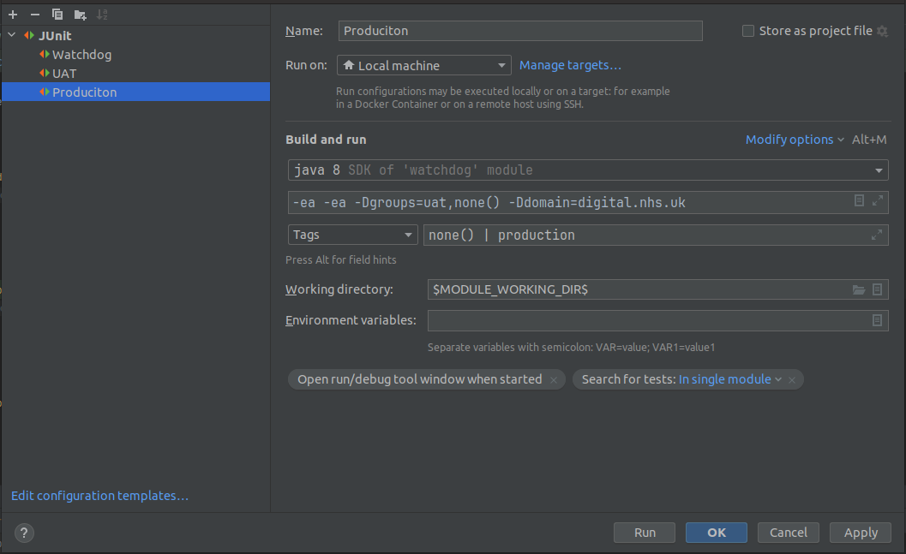
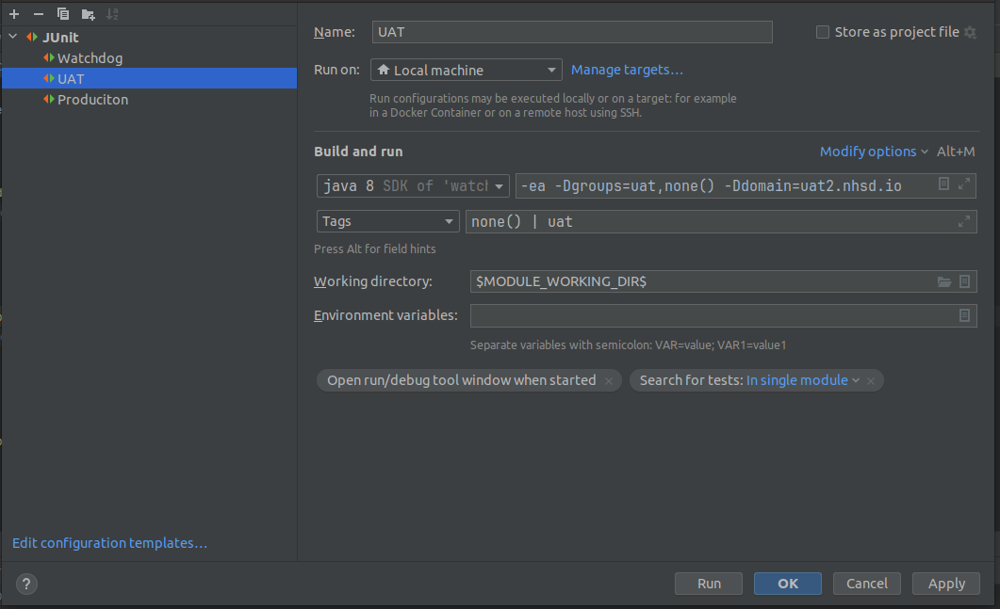
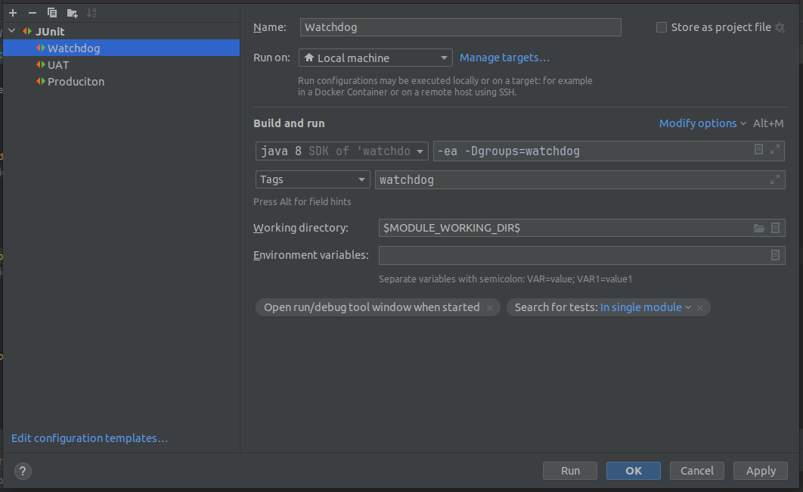

# Watchdog
A Production Monitor for digital.nhs.uk, that is watching out for real-world misconfigurations.

This repository aims to safeguard the continued reliability, performance, and security of digital.nhs.uk as it interacts with real-world users. 

To ensure the highest level of service, digital.nhs.uk's codebase is thoroughly tested at every stage, aiming to catch issues early. For example, in controlled testing environments, we use unit tests, automatic continuous integration tests, and functional acceptance tests, and that’s just to name a few of our methods. However, over the years, odd issues have arisen in production that could have only arisen under real-world conditions, such as DNS network misconfigurations. 

The critical aspects of this repository are that it’s lightweight (it gives production a minimal extra workload), the tests are of real-world environmental situations only (the tests couldn’t be carried out earlier in the pipeline), and its system agnostic (it doesn’t know about production’s software and hardware).

# First time setup
You will need Java 8 or above installed on your machine, and you will need to install [Maven](https://maven.apache.org/install.html), if you don't already have them.

Once you have the above installed, execute this Maven command in the directory where your project's POM file is located.
```bash
mvn dependency:resolve
```
This will resolve the project's dependences.

# Running Watchdog a local development machine
To run Watchdog on a local machine, the properties for the respective subject must be set.

## Run Watchdog against production
The respective properties for running Watchdog against production are `groups=production,none()`, and domain: `domain=digital.nhs.uk`.

This will result in Watchdog running tests against the production environment.

Note `none()` is a special tag that will run non tagged tests (i.e. @Test without @Production or @Uat).

### Terminal Example
```bash
mvn test "-Dgroups=production,none()" "-Ddomain=digital.nhs.uk"
```

### IntelliJ Example


## Run Watchdog against UAT
The respective properties for running Watchdog against UAT are `groups=uat,none()`, and domain: `domain=uat2.nhsd.io`.

This will result in Watchdog running tests against the UAT environment.

Note `none()` is a special tag that will run non tagged tests (i.e. @Test without @Production or @Uat).

### Terminal Example
```bash
mvn test "-Dgroups=uat,none()" "-Ddomain=uat2.nhsd.io"
```

### IntelliJ Example



To run Watchdog you simply need to run the following command:
```bash

## Run Watchdog against itself
The respective properties for running Watchdog against itself (i.e. this project code) are `groups=watchdog`.

This will result in Watchdog running tests against its own source code.

### Terminal Example
```bash
mvn test "-Dgroups=watchdog"
```

### IntelliJ Example



# Adding a new test
To add a new test, create a method and annotated with the `@Test` annotation (see [J Unit](https://junit.org/junit5/docs/current/user-guide/#writing-tests) for details). If the test is only for a specific environment tag it with `@Production` or `@Uat` respectively. For example:

```java
package uk.nhs.england;

import org.junit.jupiter.api.Test;
import uk.nhs.england.tags.Production;
import uk.nhs.england.tags.Uat;

import static org.junit.jupiter.api.Assertions.assertTrue;


public class HelloWorldTest {

    @Test @Uat // only UAT
    public void productionShouldAnswerWithTrue() {
        assertTrue(true);
    }

    @Test @Production // only Production
    public void uatShouldAnswerWithTrue() {
        assertTrue(true);
    }

    @Test // either UAT or Production
    public void alwaysShouldAnswerWithTrue() {
        assertTrue(true);
    }

}
```

# Expected output
This project essentially runs a series of J Unit tests. The output should look something like this:

```bash
[INFO] -------------------------------------------------------
[INFO]  T E S T S
[INFO] -------------------------------------------------------
[INFO] Running uk.nhs.england.CheckSubjectTest
[INFO] Tests run: 2, Failures: 0, Errors: 0, Skipped: 0, Time elapsed: 0.063 s -- in uk.nhs.england.CheckSubjectTest
[INFO] 
[INFO] Results:
[INFO] 
[INFO] Tests run: 2, Failures: 0, Errors: 0, Skipped: 0
[INFO] 
[INFO] ------------------------------------------------------------------------
[INFO] BUILD SUCCESS
[INFO] ------------------------------------------------------------------------
[INFO] Total time:  2.792 s
[INFO] Finished at: 2023-09-13T10:27:13+01:00
[INFO] ------------------------------------------------------------------------
```

And will gernate the flowing reports:
- Placeholder
- Placeholder

# Running Watchdog in Production
The GitHub Actions Workflow service runs Watchdog.

Watchdog is made up of two worflows, one for [UAT](.github/workflows/test-runner-uat.yml) and one for [Production](.github/workflows/test-runner-production.yml).

For details on using GitHub Actions' `secrets` see [encrypted secrets](https://docs.github.com/en/actions/reference/encrypted-secrets).
For details on using GitHub Actions' `vars` see [variables](https://docs.github.com/en/actions/learn-github-actions/variables).

## UAT details
UAT is triggered by our log scanner. When our log scanner detects a new UAT deployment it dispatches a GitHub webhook.

See:
- alerts  > UAT Started
- actions > UAT Run Watchdog

The workflow requires the following vars to be set:
- `SLACK_CHANNEL_UAT` this is the ID of our dedicated UAT Slack channel.

And the following secrets to be set:
- `SLACK_API_TOKEN` this is the Slack API token of our Slack Bot.


## Production details
Production is triggered by a Workflow CRON job.

The workflow requires the following vars to be set:
- `SLACK_CHANNEL_PRODUCTION` this is the ID of our dedicated Production Slack channel.

And the following secrets to be set:
- `SLACK_API_TOKEN` this is the Slack API token of our Slack Bot.
